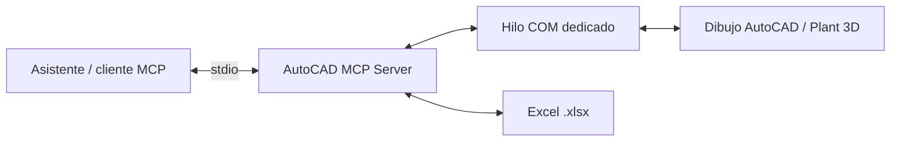

# AutoCAD MCP Server

**Conecta tu asistente de IA con los dibujos de AutoCAD. Consulta, dibuja y sincroniza atributos de bloques con Excel.**

[](https://github.com/C48H74/autocad-mcp/actions/workflows/tests.yml)
[](pyproject.toml)
[](config.example.toml)
[](LICENSE)

[English](README.md) · [Português](README.pt-BR.md) · [Español](README.es.md)

Servidor local del [Model Context Protocol](https://modelcontextprotocol.io/) para **AutoCAD y el entorno de dibujo de AutoCAD Plant 3D**, desarrollado con Python, FastMCP del SDK MCP y COM de Windows (`pywin32`). Orientado a flujos de tuberías y soportes: capas, atributos, coordenadas y hojas de cálculo.

> **Versión inicial 0.1.0.** Las pruebas automatizadas utilizan un AutoCAD simulado y un proceso stdio real. La compatibilidad con versiones concretas de AutoCAD/Plant 3D y el comportamiento de deshacer requieren validación en un dibujo desechable. Proyecto independiente, sin afiliación con Autodesk.

[Instalación](#instalación) · [Herramientas](#herramientas) · [Configuración](#configuración) · [Alcance-en-Plant-3D](#alcance-en-plant-3d) · [Contribuir](CONTRIBUTING.md)

## Funcionalidades

- Consultar documentos, capas, entidades, definiciones de bloques y atributos.
- Crear líneas, polilíneas, círculos y textos; mover, copiar y eliminar entidades del espacio modelo.
- Exportar e importar `.xlsx`; actualizar bloques mediante una clave de atributo, como `TAG`.
- Revisar operaciones por lotes con `dry_run`; determinadas acciones destructivas o de sobrescritura exigen `confirm=true`.
- Ejecutar AutoLISP opcional mediante `run_lisp`, deshabilitado por defecto.



## Requisitos

- Windows con AutoCAD de escritorio y API COM disponible, o el entorno AutoCAD de Plant 3D, con licencia válida.
- Python **3.11 o posterior**, arquitectura compatible y `pywin32` en el entorno del servidor.
- Un cliente MCP que admita servidores locales por stdio, como Claude Desktop.
- AutoCAD y el cliente ejecutándose con el mismo usuario de Windows y el mismo nivel de privilegios.

Este repositorio todavía no certifica ninguna versión concreta de AutoCAD/Plant 3D. Abre la aplicación y un dibujo de prueba antes de usar las herramientas. El inicio automático está deshabilitado. Linux y macOS pueden ejecutar pruebas simuladas, pero no controlar AutoCAD mediante este puente COM de Windows.

## Instalación

En PowerShell:

```powershell
git clone https://github.com/C48H74/autocad-mcp.git
cd autocad-mcp
py -3 -m venv .venv
.\.venv\Scripts\python.exe -m pip install -e ".[dev]"
Copy-Item config.example.toml config.toml
.\.venv\Scripts\python.exe -m pytest -m "not autocad"
```

También puedes ejecutar `uv sync` y después `uv run python -m pytest -m "not autocad"`. Utiliza siempre el Python del entorno donde instalaste el proyecto. Se utiliza SDK MCP 1.x (`mcp<2`); la API de servidor cambia en SDK 2.x.

### Conectar Claude Desktop

Añade esta entrada a `%APPDATA%\Claude\claude_desktop_config.json`, conservando los servidores existentes y sustituyendo las rutas por rutas absolutas reales:

```json
{
  "mcpServers": {
    "autocad": {
      "command": "C:\\ruta\\autocad-mcp\\.venv\\Scripts\\python.exe",
      "args": ["-m", "autocad_mcp"],
      "env": {
        "AUTOCAD_MCP_CONFIG": "C:\\ruta\\autocad-mcp\\config.toml"
      }
    }
  }
}
```

Cierra por completo el cliente, incluida la bandeja del sistema, y vuelve a abrirlo. Empieza por `status` y comprueba documento activo y unidades. Los demás clientes stdio pueden utilizar el mismo ejecutable, argumentos y variable de entorno. Las descripciones de las herramientas y los mensajes internos del servidor siguen en portugués.

### Primer flujo de trabajo

1. Abre un dibujo desechable y consulta `status`.
2. Pide: «Lee los atributos de los bloques SUP-TEST y muestra TAG, TIPO, LINHA y coordenadas X/Y».
3. Pide: «Simula la importación de soportes.xlsx con bloque SUP-TEST y clave TAG. Usa dry_run y muestra inserciones y actualizaciones».
4. Revisa la propuesta antes de aplicarla. `confirm=true` es un argumento de herramienta, **no un mecanismo independiente de autorización humana**.

## Herramientas

El servidor registra **26 herramientas**. La [referencia](docs/tools.md) incluye firmas y valores predeterminados extraídos del código.

| Grupo | Herramientas |
|---|---|
| Sesión | `status`, `list_documents`, `set_active_document`, `save_document`, `zoom_extents` |
| Capas | `list_layers`, `create_layer`, `check_layer_standard` |
| Consultas | `query_entities`, `get_entity` |
| Dibujo | `draw_line`, `draw_polyline`, `draw_circle`, `add_text`, `add_mtext`, `move_entity`, `copy_entity`, `delete_entities` |
| Bloques | `list_block_definitions`, `insert_block`, `read_block_attributes`, `update_block_attributes` |
| Excel | `export_blocks_to_excel`, `import_blocks_from_excel`, `sync_attributes_from_excel` |
| Avanzado | `run_lisp` — deshabilitada por defecto |

Las respuestas utilizan `{ok, data, warnings, error}`. Las coordenadas incluyen unidades del dibujo. Las consultas admiten paginación. Las ediciones agrupadas con `StartUndoMark`/`EndUndoMark` buscan permitir deshacer la llamada en un paso; **no constituyen una reversión automática de errores**. La escritura de archivos y `run_lisp` quedan fuera de esa garantía. Verifica el comportamiento en AutoCAD real.

## Configuración

Copia [config.example.toml](config.example.toml) a `config.toml`, o indica su ruta absoluta mediante `AUTOCAD_MCP_CONFIG`. El archivo local se excluye de Git.

| Parámetro | Predeterminado | Función |
|---|---|---|
| `server.enable_lisp` | `false` | Activar ejecución avanzada de AutoLISP |
| `server.allow_launch` | `false` | Permitir iniciar AutoCAD |
| `server.prog_id` | `AutoCAD.Application` | Aplicación COM registrada |
| `server.com_binding` | `dynamic` | Enlace dinámico; alternativa `gencache` |
| `server.com_timeout_s` | `120` | Tiempo de espera; no cancela una llamada COM bloqueada |
| `limits.default_limit` | `50` | Tamaño de página predeterminado |
| `limits.max_limit` | `500` | Máximo de resultados por página |
| `limits.max_batch_rows` | `2000` | Máximo de filas Excel por llamada |
| `excel.allowed_dirs` | `[]` | Sin restricción de directorios cuando está vacío |

Configura directorios permitidos para los libros de trabajo. Los registros van a stderr y a `logs/server.log` con rotación; stdout se reserva al protocolo MCP. Los registros pueden incluir rutas, metadatos y expresiones LISP: revísalos antes de compartirlos.

## Intercambio con Excel

La exportación incluye `HANDLE, BLOCO, CAMADA, X, Y, Z, ROTACAO, ESCALA_X, ESCALA_Y, ESCALA_Z` y una columna por atributo. La importación reconoce alias en inglés y permite un mapeo explícito de columnas. Las celdas vacías conservan los atributos existentes. `key_tag="TAG"` permite actualizar bloques coincidentes; utiliza claves estables y únicas y revisa la simulación.

Solo se admite `.xlsx`. Las fórmulas necesitan valores calculados guardados en caché por una aplicación de hojas de cálculo. Genera un ejemplo con:

```powershell
.\.venv\Scripts\python.exe examples\make_test_workbook.py C:\Temp\soportes_prueba.xlsx
```

## Validación con AutoCAD real

Las pruebas en vivo modifican el dibujo. Utiliza exclusivamente un archivo desechable:

1. Crea `MCP_TEST.dwg` a partir de una plantilla métrica y configura `INSUNITS=4` (milímetros).
2. Crea las capas `EIXOS`, `SUPORTES`, `PIPE-100` y `LIXO`.
3. Define el bloque `SUP-TEST` con geometría sencilla y atributos editables `TAG`, `TIPO` y `LINHA`. Conserva estos nombres, ya que los utilizan las pruebas.
4. Deja el dibujo activo, sin comandos ni diálogos abiertos.
5. Ejecuta:

```powershell
.\.venv\Scripts\python.exe -m pytest -m autocad
```

La suite se omite si no encuentra AutoCAD o el nombre del dibujo no empieza por `MCP_TEST`. Comprueba que las pruebas se ejecutan realmente: un resultado de pruebas omitidas no valida COM. Incluye la versión exacta de AutoCAD/Plant 3D al comunicar resultados.

Para pruebas simuladas y transporte stdio real:

```powershell
.\.venv\Scripts\python.exe -m pytest -m "not autocad"
```

Consulta [el registro de validación](docs/validation.md) y [la guía técnica en portugués](README.pt-BR.md).

## Alcance en Plant 3D

El servidor opera **objetos genéricos de AutoCAD mediante COM**. No implementa el SDK .NET de Plant 3D, DataLinksManager, la base de datos del proyecto, enrutamiento de tuberías por especificación ni generación nativa de isométricos. Los objetos específicos o proxy pueden exponer solo propiedades genéricas y cajas envolventes. La geometría genérica no equivale a componentes inteligentes de Plant 3D.

Otras limitaciones:

- Solo espacio modelo; las definiciones de bloques deben existir previamente.
- Los atributos constantes no se gestionan como atributos editables.
- El comportamiento con UCS girado necesita validación en AutoCAD real.
- Los diálogos modales pueden bloquear COM; un timeout no detiene la operación subyacente.
- `SendCommand` es asíncrono y no devuelve directamente el resultado de AutoLISP.
- El filtro AutoLISP es una protección parcial, **no un sandbox**.

## Resolución de problemas

| Síntoma | Comprobación |
|---|---|
| `autocad_not_running` | AutoCAD abierto, API COM registrada, mismo usuario y privilegios |
| `autocad_busy` | Finaliza comandos y cierra diálogos antes de reintentar |
| Timeout COM | Cierra ventanas modales; la llamada podría seguir en curso |
| No aparecen herramientas | Rutas absolutas, JSON válido, entorno Python correcto y reinicio del cliente |
| Error al escribir Excel | Cierra el libro en Excel; comprueba permisos y directorios permitidos |
| Valores de fórmula vacíos | Abre y guarda el libro en una aplicación que calcule las fórmulas |
| Error importando FastMCP | Reinstala las dependencias del proyecto; se requiere `mcp<2` |

## Contribución, soporte y seguridad

Se aceptan incidencias en español, portugués e inglés. Consulta [CONTRIBUTING.md](CONTRIBUTING.md), [SUPPORT.md](SUPPORT.md), [SECURITY.md](SECURITY.md) y [CODE_OF_CONDUCT.md](CODE_OF_CONDUCT.md). Comparte únicamente ejemplos anonimizados, sin dibujos de clientes ni credenciales.

El servidor se ejecuta localmente, pero el cliente de IA puede enviar los resultados a su proveedor. Respeta las normas de confidencialidad de tu organización.

## Licencia

[MIT](LICENSE) © 2026 Daniel de Souza Paixão. AutoCAD y AutoCAD Plant 3D son marcas de Autodesk, Inc. Proyecto independiente, sin afiliación ni respaldo de Autodesk.
