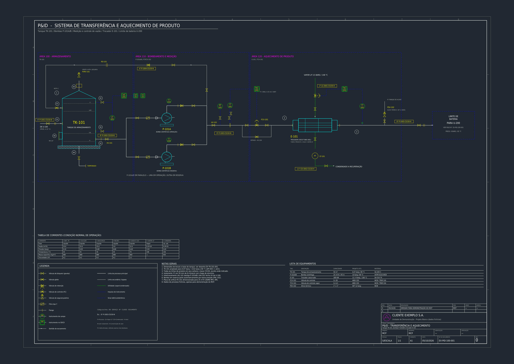
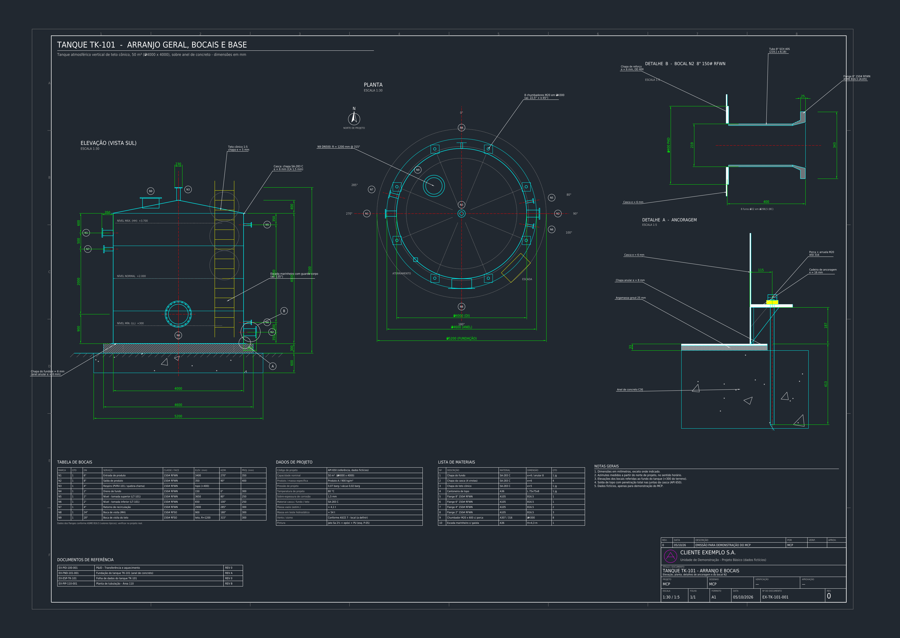
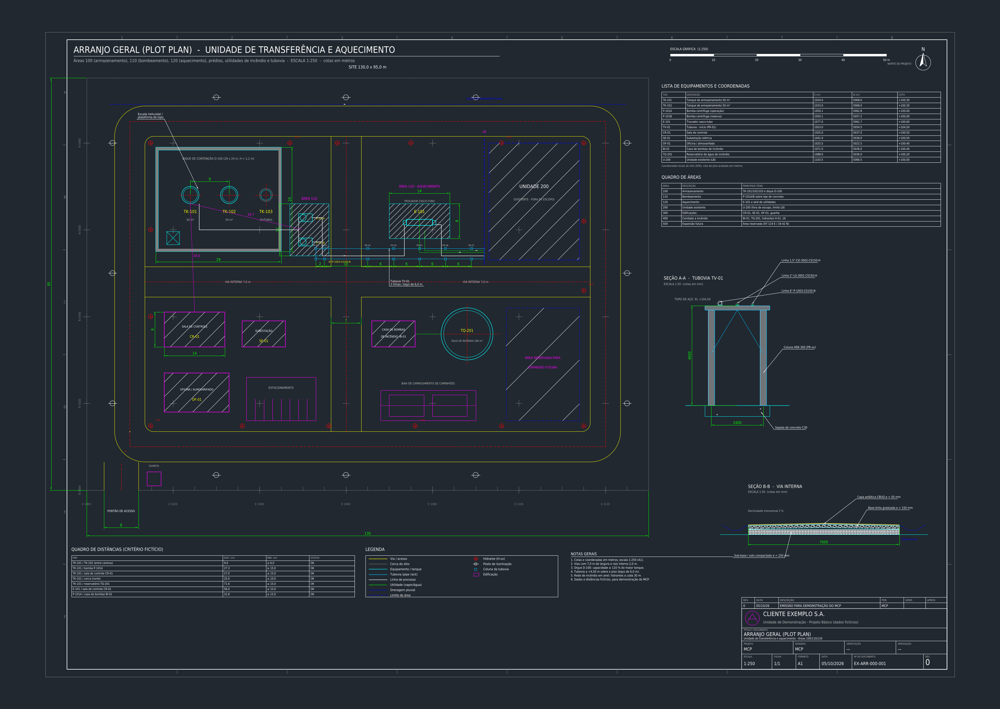
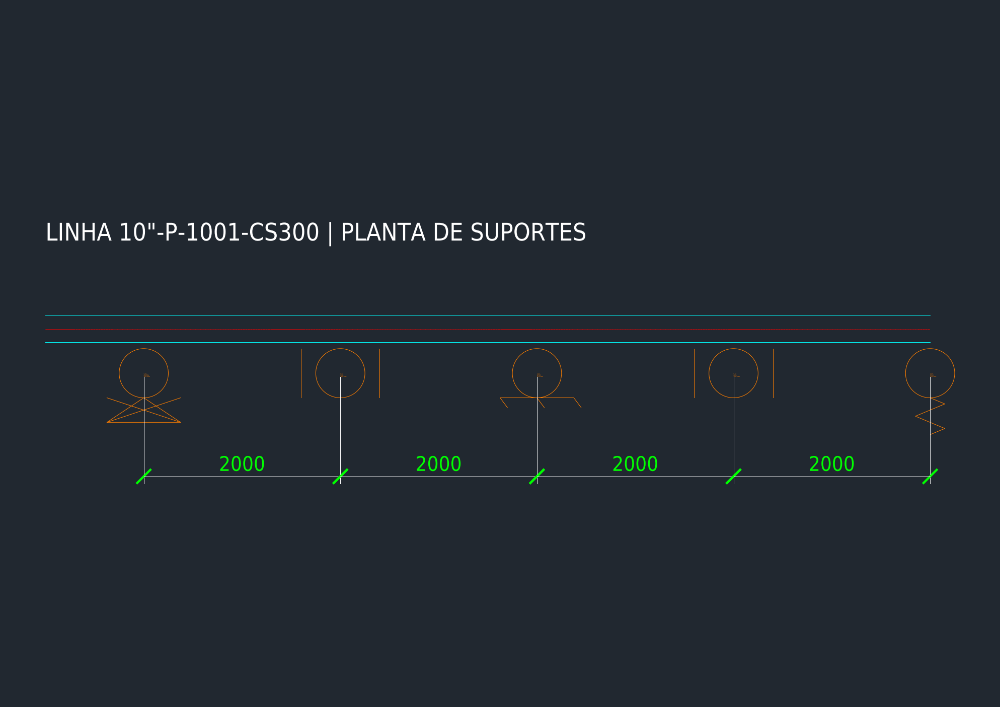
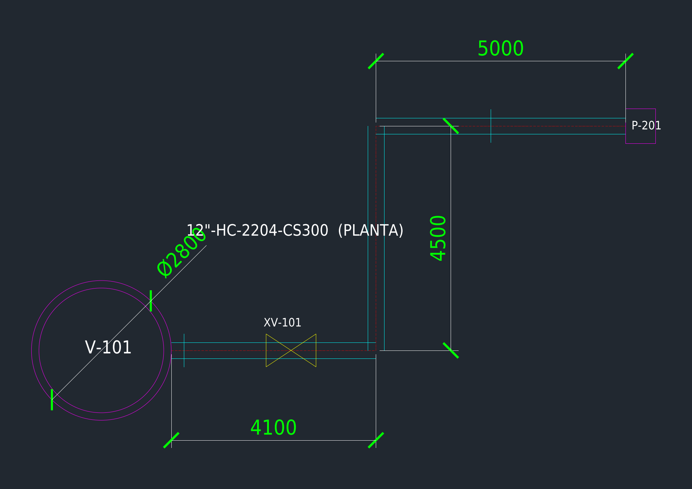
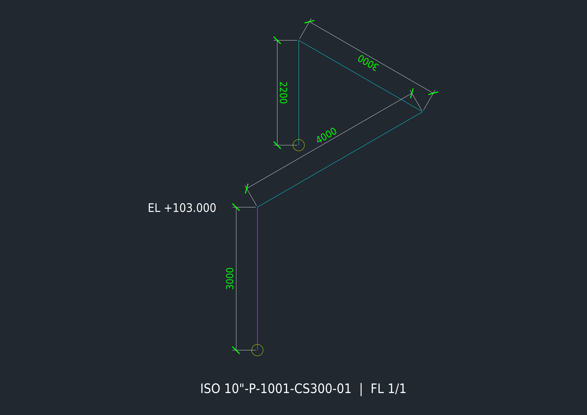
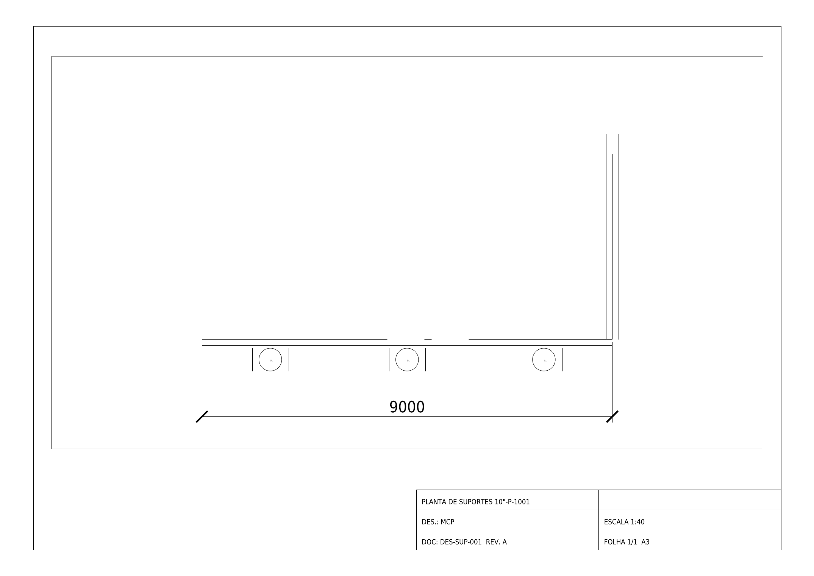
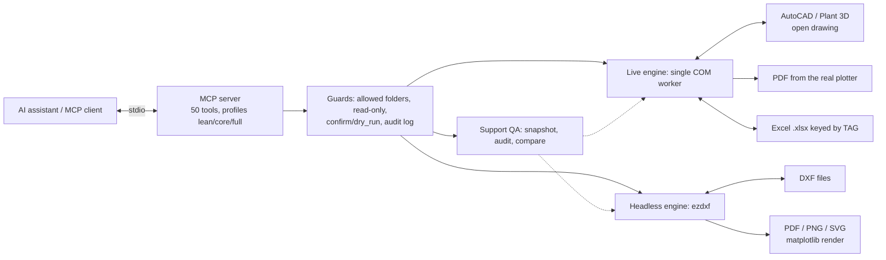

<!-- mcp-name: io.github.C48H74/autocad-mcp -->
<div align="center">

# AutoCAD MCP for Piping & Pipe Supports

**Connect an AI assistant to AutoCAD / Plant 3D, live through COM or headless through ezdxf. One typed contract, two engines, 50 tools.**

[](https://github.com/C48H74/autocad-mcp/actions/workflows/tests.yml)
[](pyproject.toml)
[](config.example.toml)
[](#the-two-engines)
[](LICENSE)

[English](README.md) · [Português](README.pt-BR.md) · [Español](README.es.md)

[Install](#install) · [Showcase](#showcase) · [Tools](#tools) · [Engines](#the-two-engines) · [Limits](#limits) · [Config](#configuration) · [Changelog](CHANGELOG.md)

</div>



**Not a mockup.** Every line on this A1 sheet was drawn by the tools this server exposes (layers, ISA 5.1 instrument balloons, valves, tag lines, stream table, title block), then rendered headlessly. Rebuild it with `python examples/showcase/pid.py docs/images`. All data is fictional.

> **v0.3.1.** 188 automated tests (simulated AutoCAD, offline DXF engine, real stdio subprocess) plus 7 opt-in live tests that passed on **AutoCAD Plant 3D 2021** only. Other versions and native Plant 3D objects are not certified. See [validation notes](docs/validation.md).

## Showcase

Three complete A1 sheets, each one generated by a script in [`examples/showcase/`](examples/showcase/) that calls the same engine the MCP tools use. Every sheet is saved as `.dxf` (opens in AutoCAD) and `.png`.

| Sheet | What it shows | Rebuild |
|---|---|---|
| **P&ID** | Tank TK-101 with nozzles N1-N8, parallel pumps P-101A/B, flow loop FT/FIC/FCV with bypass, heat exchanger E-101 with temperature control and steam trap, thermal relief PSV, battery limit, stream table, legend, notes, equipment list, title block | `python examples/showcase/pid.py docs/images` |
| **Tank with nozzles and foundation** | 50 m3 vertical tank, elevation and plan 1:30, Detail A (anchorage) and Detail B (nozzle N2 8" 150# RFWN) 1:5, chain dimensions, nozzle schedule, design data, bill of materials | `python examples/showcase/tanque.py docs/images` |
| **General arrangement (plot plan)** | Plot plan 1:250 with roads, dike, tanks, pump pad, pipe rack, exchanger skid, buildings, fire water, coordinate grid, computed distance table, sections A-A and B-B 1:50 | `python examples/showcase/layout.py docs/images` |



*Tank sheet: dimensioned elevation and plan, anchorage and nozzle details, nozzle schedule.*



*Plot plan 1:250: the distance table is computed from the equipment coordinates, not typed.*

Smaller examples from [`examples/gallery.py`](examples/gallery.py):

| | |
|---|---|
|  |  |
|  |  |

The images are an approximate ezdxf/matplotlib render, not an AutoCAD capture. The showcase is also a test: `tests/test_showcase.py` runs all three scripts and checks `doc.audit()` for errors.

## What's new in 0.3

| Track | What it adds |
|---|---|
| **Headless DXF engine** | `dxf_*` tools on ezdxf: create/edit drawings, query entities, read block attributes, read-only SQL (`dxf_sql_query`), audit, native dimensions, paper layouts with scaled viewports, PDF/PNG/SVG export, support pictograms (GUIA/ANCORA/APOIO/MOLA) with TAG/TIPO/LINHA |
| **Live AutoCAD additions** | `add_dimension` (native DIMENSION), `plot_to_pdf` (real "DWG To PDF.pc3" plotter), `project_data_set/get` (metadata stored inside the DWG) |
| **Scaled drawings** | `dxf_add_dimensions` accepts `lfac`, so a detail drawn at 1:5 still reads real-world distances |
| **Safer by default** | File I/O limited to `~/autocad-mcp-workspace` unless `[paths].allowed_dirs` is set; DXF edit tools accept `output_path` to keep the original; optional JSONL audit trail; profiles `lean` / `core` / `full` |
| **Fixed** | Layer color/linetype now applied by the DXF engine; queries no longer leave an empty undo step |

Workflow: ask for a DXF copy of the drawing, let the assistant edit, dimension and export it offline, or work live in the open drawing. A DWG cannot be read without AutoCAD.

## Why this exists

Built by a piping and pipe-supports engineer, so the focus is on what that work needs: block attributes (TAG / TIPO / LINHA), layers, coordinates, support registers that can be audited and compared by TAG across revisions, and Excel round-trips. It is not a general CAD toolbox; it is a narrow tool with its limits written down.



## Install

```powershell
git clone https://github.com/C48H74/autocad-mcp.git
cd autocad-mcp
py -3 -m venv .venv
.\.venv\Scripts\python.exe -m pip install -e ".[dev]"   # installs ezdxf and matplotlib too
Copy-Item config.example.toml config.toml
.\.venv\Scripts\python.exe -m pytest -m "not autocad"
```

Or `uv sync` and `uv run python -m pytest -m "not autocad"`. The project uses MCP SDK 1.x (`mcp<2`).

Requirements: Python 3.11+ (64-bit, same architecture as AutoCAD). Live COM needs Windows with a licensed AutoCAD desktop (or the Plant 3D environment) running with a test drawing open, under the same user and privilege level as the MCP client. The headless DXF engine runs on any OS.

### Wire it to Claude Desktop

Edit `%APPDATA%\Claude\claude_desktop_config.json` (Settings, Developer, Edit Config) with absolute paths:

```json
{
  "mcpServers": {
    "autocad": {
      "command": "C:\\path\\to\\autocad-mcp\\.venv\\Scripts\\python.exe",
      "args": ["-m", "autocad_mcp"],
      "env": { "AUTOCAD_MCP_CONFIG": "C:\\path\\to\\autocad-mcp\\config.toml" }
    }
  }
}
```

Fully quit and reopen Claude Desktop; the `autocad` server should list 50 tools. Start with `status` and verify the active drawing and units. Any local stdio client can use the same command, args and environment variable. Internal tool descriptions and diagnostics are currently in Portuguese.

## Tools

50 tools in 11 groups. Signatures and defaults: [docs/tools.md](docs/tools.md).

| Group | Tools |
|---|---|
| Session | `status`, `list_documents`, `set_active_document`, `save_document`, `zoom_extents` |
| Layers | `list_layers`, `create_layer`, `check_layer_standard` |
| Query | `query_entities`, `get_entity` |
| Drawing | `draw_line`, `draw_polyline`, `draw_circle`, `add_text`, `add_mtext`, `move_entity`, `copy_entity`, `delete_entities` |
| Blocks | `list_block_definitions`, `insert_block`, `read_block_attributes`, `update_block_attributes` |
| Excel | `export_blocks_to_excel`, `import_blocks_from_excel`, `sync_attributes_from_excel` |
| Dimensions / plot / project data (live) | `add_dimension`, `plot_to_pdf`, `project_data_set`, `project_data_get` |
| DXF read (offline) | `dxf_info`, `dxf_query`, `dxf_get_entity`, `dxf_read_attributes`, `dxf_sql_query`, `dxf_audit` |
| DXF write (offline) | `dxf_create`, `dxf_create_layer`, `dxf_add_entities`, `dxf_define_block`, `dxf_modify_entities`, `dxf_delete_entities`, `dxf_add_dimensions`, `dxf_create_layout`, `dxf_export`, `dxf_insert_support_symbol` |
| Support QA | `system_capabilities`, `snapshot_support_register`, `audit_support_register`, `compare_support_register` |
| Advanced | `run_lisp` (disabled by default) |

**Support register quality.** Capture a complete support register, find duplicate TAGs and missing attributes, reconcile project-provided expected tags, and compare revisions by TAG even when CAD handles change. Audit and comparison run offline on captured snapshots. They do not validate structural loads or native Plant 3D data. [Workflow and limits](docs/support-quality.md).

### Example prompts

- "Read the attributes of every SUP-TEST block and give me a table with TAG, TIPO, LINHA and X/Y."
- "Import suportes.xlsx (block SUP-TEST, key TAG). Do a dry run first and tell me how many insert and how many update."
- "Change TIPO to ANCORA on all blocks of line 10-P-1001. Show a preview and apply only after I confirm."
- "Create an A1 sheet at 1:30 with a tank elevation, dimension the nozzles and export a PDF."

## The two engines

| Capability | COM (live AutoCAD) | ezdxf (headless) |
|---|---|---|
| Live document control | yes | no |
| Runs without AutoCAD, any OS | no | yes |
| Native DIMENSION | yes | yes (`render()`, `lfac` for scaled views) |
| Paper layouts and viewports | via drawing | yes |
| PDF plot | real plotter (`plot_to_pdf`) | matplotlib render (approximate) |
| Block attributes read/write | yes | yes |
| Excel round-trip keyed by TAG | yes | via DXF read |
| Read-only SQL over entities | no | yes (`dxf_sql_query`) |
| DWG read/write | yes | no (DXF only) |
| 3D solids | not exposed | not copied (ezdxf cannot import 3DSOLID) |

Grouped drawing edits use `StartUndoMark/EndUndoMark`; one-step undo was verified live on Plant 3D 2021 (100-block import undone with one Ctrl+Z). This is not automatic rollback and does not cover file writes or `run_lisp`. Selected destructive actions need `confirm=true`; batch tools support `dry_run`. The flag is not independent human authorization.

## Limits

- **Plant 3D.** Generic AutoCAD objects only, through COM. No Plant 3D .NET SDK, DataLinksManager, project database, spec-driven routing or native isometrics. Proxy objects may expose only generic properties and bounding boxes.
- **Certification.** Live tests passed on AutoCAD Plant 3D 2021 only. Rotated UCS has not been validated.
- **Model space only**; block definitions must already exist. Constant attributes need care.
- **Renders are approximate.** PNG/PDF from the headless engine come from ezdxf + matplotlib. Hatch patterns at small scale (for example AR-CONC) can look speckled.
- **DWG needs AutoCAD.** The headless engine reads and writes DXF.
- **`run_lisp`** is off by default; its filtering is partial protection, not a sandbox.
- **Showcase sheets are fictional** and use a made-up drawing standard; they are not for construction.

## Configuration

Copy [config.example.toml](config.example.toml) to `config.toml` or set `AUTOCAD_MCP_CONFIG` to its absolute path.

| Setting | Default | Meaning |
|---|---|---|
| `server.enable_lisp` | false | Optional AutoLISP execution |
| `server.allow_launch` | false | Allow starting AutoCAD |
| `server.prog_id` | AutoCAD.Application | Registered COM application |
| `server.com_timeout_s` | 120 | Wait limit; does not cancel blocked COM calls |
| `server.profile` | full | `lean` (13 tools), `core` (37) or `full` (50) |
| `server.audit_log` | false | JSONL trail in `logs/audit.jsonl` (no parameters recorded) |
| `limits.max_limit` | 500 | Maximum results per page |
| `limits.max_batch_rows` | 2000 | Maximum Excel rows per call |
| `limits.scan_threshold` | 3000 | Up to this many entities, queries scan directly (no empty undo step) |
| `paths.allowed_dirs` | [] | Folders for all file I/O (DXF, PDF, PNG, Excel). Empty = only `~/autocad-mcp-workspace` |
| `paths.allow_any` | false | Opt in to unrestricted file paths |

Environment overrides: `AUTOCAD_MCP_CONFIG`, `AUTOCAD_MCP_READ_ONLY=1`, `AUTOCAD_MCP_ALLOWED_DIRS`, `AUTOCAD_MCP_WORKSPACE`. Logs go to stderr and rotating `logs/server.log`; stdout is reserved for MCP. Review logs before sharing.

## Troubleshooting

| Symptom | Check |
|---|---|
| `autocad_not_running` | Open AutoCAD; check COM registration and matching user/privileges |
| `autocad_busy` | Finish commands and close dialogs (a command waiting for ENTER blocks COM) |
| COM timeout | A modal dialog may be blocking COM; the call may still be running |
| Tools missing | Absolute paths, valid JSON, correct Python environment, client restart |
| Excel write failure | Close the workbook; check permissions and allowed directories |

## Development

```powershell
.\.venv\Scripts\python.exe -m pytest -m "not autocad"   # 188 tests
.\.venv\Scripts\python.exe examples\gallery.py           # small gallery -> docs/images
.\.venv\Scripts\python.exe examples\showcase\pid.py docs\images
```

CI runs the same suite on Linux and Windows (simulated COM). More: [CONTRIBUTING.md](CONTRIBUTING.md), [SUPPORT.md](SUPPORT.md), [SECURITY.md](SECURITY.md), [CODE_OF_CONDUCT.md](CODE_OF_CONDUCT.md), [source comparison](docs/comparison-u-c4n.md).

## Safety

This server can modify and save drawings. Work on copies, keep backups, review previews before confirming, and do not open confidential client drawings with an assistant unless your company policy allows it.

## Author

Daniel de Souza Paixão, piping stress and pipe-supports engineer. Built from day-to-day drawing work, then exposed through MCP.

## License

[MIT](LICENSE) © 2026 Daniel de Souza Paixão. Third-party inspirations: see [NOTICE](NOTICE).

AutoCAD is a trademark of Autodesk, Inc. This project is independent and not affiliated with or endorsed by Autodesk.
