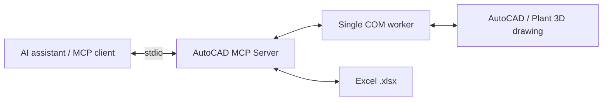

# AutoCAD MCP Server

**Connect your AI assistant to AutoCAD drawings. Inspect, draw and round-trip block attributes with Excel.**

[](https://github.com/C48H74/autocad-mcp/actions/workflows/tests.yml)
[](pyproject.toml)
[](config.example.toml)
[](LICENSE)

[English](README.md) · [Português](README.pt-BR.md) · [Español](README.es.md)

A local **MCP server** (Python, FastMCP, stdio) that lets compatible AI assistants read and modify drawings open in **AutoCAD / AutoCAD Plant 3D** through COM (`pywin32`). Built by a piping and pipe-supports engineer, so the focus is on block attributes, layers, coordinates and Excel round-trips.



> **Early release · v0.1.0.** Automated tests use a simulated AutoCAD and a real stdio subprocess. Live AutoCAD/Plant 3D compatibility and undo behavior require validation on a disposable drawing. See [validation notes](docs/validation.md).

[Install](#install) · [Tools](#tools) · [Configuration](#configuration) · [Plant 3D scope](#plant-3d-scope) · [Contributing](CONTRIBUTING.md)

## Highlights

- **26 tools**: session, layers, queries, drawing, blocks with attributes, Excel import/export, optional AutoLISP.
- **Grouped drawing edits** use StartUndoMark/EndUndoMark; intended one-step undo needs live validation. This is not automatic rollback and does not cover file writes or run_lisp.
- **Reviewable operations**: selected destructive/overwrite actions need `confirm=true`; batch tools support `dry_run`. The flag is not independent human authorization.
- **Excel round-trip** keyed by an attribute TAG: re-importing updates instead of duplicating.
- **Robust COM handling**: single COM thread, retry/backoff when AutoCAD is busy, reconnection, timeouts.
- `run_lisp` is **off** unless you enable it in the config.

## Requirements

- Windows with a licensed AutoCAD desktop COM installation (or the AutoCAD environment in Plant 3D), running with a test drawing open. No specific release is certified yet.
- Python 3.11+ (64-bit, same architecture as AutoCAD)
- AutoCAD and Claude Desktop under the same user and privilege level

## Install

```powershell
git clone https://github.com/C48H74/autocad-mcp.git
cd autocad-mcp
py -3 -m venv .venv
.\.venv\Scripts\python.exe -m pip install -e ".[dev]"
Copy-Item config.example.toml config.toml
.\.venv\Scripts\python.exe -m pytest -m "not autocad"
```

Alternatively use `uv sync` and `uv run python -m pytest -m "not autocad"`. The project uses MCP SDK 1.x (`mcp<2`); SDK 2.x changes the server API.

## Claude Desktop

Edit `%APPDATA%\Claude\claude_desktop_config.json` (Settings → Developer → Edit Config), using absolute paths:

```json
{
  "mcpServers": {
    "autocad": {
      "command": "C:\\path\\to\\autocad-mcp\\.venv\\Scripts\\python.exe",
      "args": ["-m", "autocad_mcp"],
      "env": { "AUTOCAD_MCP_CONFIG": "C:\\path\\to\\autocad-mcp\\config.toml" }
    }
  }
}
```

Fully quit and reopen Claude Desktop. The `autocad` server should list 26 tools. Start with `status` and verify the active drawing and units. Other local stdio clients can use the same executable, arguments and environment variable. Internal tool descriptions and diagnostics currently use Portuguese.

## Tools

See [the source-derived tool reference](docs/tools.md) for signatures and defaults.

| Group | Tools |
|---|---|
| Session | `status`, `list_documents`, `set_active_document`, `save_document`, `zoom_extents` |
| Layers | `list_layers`, `create_layer`, `check_layer_standard` |
| Query | `query_entities`, `get_entity` |
| Drawing | `draw_line`, `draw_polyline`, `draw_circle`, `add_text`, `add_mtext`, `move_entity`, `copy_entity`, `delete_entities` |
| Blocks | `list_block_definitions`, `insert_block`, `read_block_attributes`, `update_block_attributes` |
| Excel | `export_blocks_to_excel`, `import_blocks_from_excel`, `sync_attributes_from_excel` |
| Advanced | `run_lisp` (disabled by default) |

## Example prompts

- "Read the attributes of every SUP-TEST block and give me a table with TAG, TIPO, LINHA and X/Y."
- "Import suportes.xlsx (block SUP-TEST, key TAG). Do a dry run first and tell me how many insert and how many update."
- "Change TIPO to ANCORA on all blocks of line 10-P-1001. Show a preview and apply only after I confirm."

## Configuration

Copy [config.example.toml](config.example.toml) to config.toml or set AUTOCAD_MCP_CONFIG to its absolute path.

| Setting | Default | Meaning |
|---|---|---|
| server.enable_lisp | false | Optional advanced AutoLISP execution |
| server.allow_launch | false | Allow starting AutoCAD |
| server.prog_id | AutoCAD.Application | Registered COM application |
| server.com_timeout_s | 120 | Wait limit; does not cancel blocked COM calls |
| limits.max_limit | 500 | Maximum results per page |
| limits.max_batch_rows | 2000 | Maximum Excel rows per call |
| excel.allowed_dirs | [] | No directory restriction when empty; configure a workbook allowlist |

Logs go to stderr and rotating logs/server.log; stdout is reserved for MCP. Review logs before sharing. There is no global read-only mode.

## Plant 3D scope

The server operates generic AutoCAD drawing objects via COM. It does not implement the Plant 3D .NET SDK, DataLinksManager, project database, spec-driven routing or native isometric generation. Plant-specific/proxy objects may expose only generic properties and bounding boxes. Generic geometry is not an intelligent Plant 3D piping component.

Model space only; block definitions must already exist. Constant attributes and rotated UCS require particular care; rotated UCS behavior has not been validated in real AutoCAD. AutoLISP filtering is partial protection, not a sandbox.

## Troubleshooting

| Symptom | Check |
|---|---|
| autocad_not_running | Open AutoCAD; check COM registration and matching user/privileges |
| autocad_busy | Finish commands and close dialogs |
| COM timeout | A modal dialog may be blocking COM; the call may still be running |
| Tools missing | Absolute paths, valid JSON, correct Python environment and client restart |
| Excel write failure | Close the workbook; check permissions and allowed directories |

## Documentation

Full documentation (design decisions, test drawing walkthrough, troubleshooting, COM API limitations) is in [Português](README.pt-BR.md) and [Español](README.es.md). See also [validation notes](docs/validation.md).

## Safety

This server can modify and save drawings. Work on copies, keep backups, and review previews before confirming. Never open confidential client drawings with an assistant unless your company policy allows it.

## Contributing

Issues and pull requests are welcome in English, Portuguese and Spanish. Read [CONTRIBUTING.md](CONTRIBUTING.md), [SUPPORT.md](SUPPORT.md), [SECURITY.md](SECURITY.md) and [CODE_OF_CONDUCT.md](CODE_OF_CONDUCT.md).

## License

[MIT](LICENSE) © 2026 Daniel de Souza Paixão

AutoCAD is a trademark of Autodesk, Inc. This project is independent and not affiliated with or endorsed by Autodesk.
