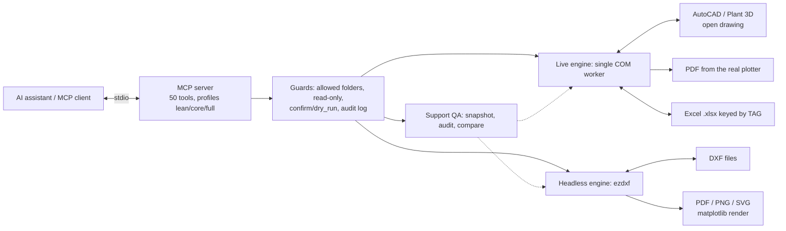

# AutoCAD MCP Server

[](https://github.com/C48H74/autocad-mcp/actions/workflows/tests.yml)
[](pyproject.toml)
[](config.example.toml)
[](LICENSE)

[English](README.md) · [Português](README.pt-BR.md) · [Español](README.es.md)

Servidor **MCP local** (Python, `FastMCP`, transporte **stdio**) que deixa o Claude Desktop ler e modificar
desenhos abertos no **AutoCAD / AutoCAD Plant 3D** via COM (`pywin32`). Foco: tubulação e suportes — blocos com
atributos, camadas, coordenadas e planilhas Excel.

> **Status de verificação (v0.3.1):** 188 testes automatizados (AutoCAD simulado, motor DXF offline e servidor stdio real)
> e 7 testes reais opcionais (`pytest -m autocad`) que **passaram no AutoCAD Plant 3D 2021**, numa máquina, num desenho
> `MCP_TEST.dwg`. Outras versões, objetos nativos do Plant 3D e desenhos de projeto **não estão certificados**: rode
> `pytest -m autocad` na sua instalação antes de confiar. Registro completo em [docs/validation.md](docs/validation.md).

## Novidades 0.3 — Motor DXF sem AutoCAD, cotas, layouts e PDF

- **DXF sem AutoCAD aberto** (`dxf_*`, ezdxf): criar/editar, consultar entidades, ler atributos de blocos, SQL somente leitura
  (`dxf_sql_query`), auditar, **cotas nativas**, **layouts** com viewports em escala e exportar **PDF/PNG/SVG**.
  `dxf_insert_support_symbol` insere pictogramas GUIA/ANCORA/APOIO/MOLA com TAG/TIPO/LINHA (simplificados, não seguem norma).
- **No AutoCAD aberto:** `add_dimension` (cota nativa), `plot_to_pdf` (plotter real "DWG To PDF.pc3"), `project_data_set/get` (metadados dentro do DWG).
- **Mais seguro por padrão:** todo arquivo lido/gravado fica restrito a `~/autocad-mcp-workspace` (ou `[paths].allowed_dirs`;
  `[paths].allow_any = true` libera tudo); edições DXF aceitam `output_path` (preserva o original); trilha JSONL opcional;
  perfis `lean`/`core`/`full`.
- **Corrigido após teste real:** consultas deixavam um passo de desfazer vazio (o 1º Ctrl+Z não fazia nada visível).
- Limites: `dxf_export` é renderização ezdxf/matplotlib (aproximada), não o plotter do AutoCAD; DXF apenas (DWG exige AutoCAD).

---

## Novidades 0.2 — Conferência de cadastros de suportes

**Diferencial para tubulação e suportes:** conferir um cadastro por TAG antes da entrega e comparar revisões sem depender dos handles do CAD.

| Nova ferramenta | Função |
|---|---|
| `system_capabilities` | Informa capacidades e modo somente leitura sem afirmar conexão com AutoCAD |
| `snapshot_support_register` | Captura blocos, atributos, posições e unidades em um escopo explícito |
| `audit_support_register` | Identifica TAGs duplicadas/ausentes, tipo/linha vazios e divergências do cadastro esperado do projeto |
| `compare_support_register` | Mostra inclusões, exclusões, deslocamentos e alterações; recusa unidades incompatíveis e deixa TAGs ambíguas pendentes |

Ative `server.read_only=true` ou `AUTOCAD_MCP_READ_ONLY=1` e reinicie para bloquear ferramentas de escrita, inclusive Excel e AutoLISP. Auditoria e comparação funcionam sem AutoCAD a partir de snapshots completos. Não dimensionam suportes nem validam dados nativos do Plant 3D.

[Fluxo e limitações](docs/support-quality.md) · [Comparação com o projeto de referência](docs/comparison-u-c4n.md)


## Arquitetura



## Escopo e segurança

Versão **0.3.1**. `confirm=true` é um parâmetro de ferramenta, não uma autorização humana independente. Há modo somente leitura configurável, descrito acima. Sem configuração, só a pasta `~/autocad-mcp-workspace` é aceita para arquivos (`[paths].allowed_dirs`; `[excel].allowed_dirs` é alias antigo). Timeout não cancela uma chamada COM bloqueada. O projeto requer SDK MCP 1.x (`mcp<2`).

[Referência das ferramentas](docs/tools.md) · [Validação](docs/validation.md) · [Contribuição](CONTRIBUTING.md) · [Segurança](SECURITY.md)

## 1. Requisitos

- Windows, AutoCAD desktop com API COM (ou o ambiente AutoCAD do Plant 3D) **aberto**, com um desenho de teste. Nenhuma versão específica está homologada neste repositório.
- Python 3.11+ (64 bits, mesma arquitetura do AutoCAD).
- [`uv`](https://docs.astral.sh/uv/) (recomendado) ou `pip`.
- AutoCAD e Claude Desktop rodando **no mesmo usuário e no mesmo nível de privilégio** (ambos normais, ou ambos
  como administrador). Diferença de privilégio impede o servidor de "enxergar" o AutoCAD (ver Troubleshooting).

## 2. Instalação passo a passo

```powershell
# 1) Copie a pasta autocad-mcp para, por exemplo, C:\Users\SEU_USUARIO\autocad-mcp e entre nela
cd C:\Users\SEU_USUARIO\autocad-mcp

# 2a) Com uv (recomendado): cria .venv e instala tudo, inclusive pytest
uv sync

# 2b) OU com pip
python -m venv .venv
.\.venv\Scripts\python.exe -m pip install -r requirements.txt
.\.venv\Scripts\python.exe -m pip install -e .

# 3) Configuração (opcional; sem ela valem os defaults seguros)
copy config.example.toml config.toml

# 4) Testes que não precisam de AutoCAD (devem passar todos)
.\.venv\Scripts\python.exe -m pytest -m "not autocad"

# 5) Teste de fumaça do servidor (com o AutoCAD aberto): deve ficar aguardando no stdin, sem imprimir nada
.\.venv\Scripts\python.exe -m autocad_mcp        # Ctrl+C para sair; o log está em logs\server.log
```

### Configuração do Claude Desktop

Edite `%APPDATA%\Claude\claude_desktop_config.json` (menu *Settings → Developer → Edit Config*) e use **caminhos
absolutos** (barras invertidas duplicadas no JSON):

```json
{
  "mcpServers": {
    "autocad": {
      "command": "C:\\Users\\SEU_USUARIO\\autocad-mcp\\.venv\\Scripts\\python.exe",
      "args": ["-m", "autocad_mcp"],
      "env": {
        "AUTOCAD_MCP_CONFIG": "C:\\Users\\SEU_USUARIO\\autocad-mcp\\config.toml"
      }
    }
  }
}
```

Alternativa com `uv` (caminho do `uv.exe` obtido com `where uv`):

```json
{
  "mcpServers": {
    "autocad": {
      "command": "C:\\Users\\SEU_USUARIO\\.local\\bin\\uv.exe",
      "args": ["--directory", "C:\\Users\\SEU_USUARIO\\autocad-mcp", "run", "autocad-mcp"]
    }
  }
}
```

Depois **feche o Claude Desktop por completo** (inclusive na bandeja) e abra de novo. O servidor `autocad` deve aparecer
com 50 ferramentas. `AUTOCAD_MCP_CONFIG` é opcional; o servidor também procura `config.toml` na raiz do projeto.

### Testar com o MCP Inspector

```powershell
npx @modelcontextprotocol/inspector C:\Users\SEU_USUARIO\autocad-mcp\.venv\Scripts\python.exe -m autocad_mcp
# ou, com uv:
npx @modelcontextprotocol/inspector uv --directory C:\Users\SEU_USUARIO\autocad-mcp run autocad-mcp
```

Abra a URL exibida, clique em **Connect**, aba **Tools → List Tools** (50 ferramentas) e rode `status` (com o AutoCAD
aberto deve trazer versão/unidade; com ele fechado, `ok:false` e `error.code:"autocad_not_running"`).

---

## 3. Como funciona (decisões de projeto)

| Tema | Decisão |
|---|---|
| **stdout** | Exclusivo do protocolo. Zero `print()` (há teste que varre o código), log em **stderr** e `logs/server.log` (rotativo). Pasta de log independente do diretório de trabalho. |
| **Thread COM** | Uma única thread (`ComWorker`) faz `CoInitialize`/`CoUninitialize` e executa *todo* acesso ao AutoCAD; as ferramentas são `async` e só esperam no executor (não travam o loop do MCP). |
| **Conexão** | `GetActiveObject` no ROT (`AutoCAD.Application`). AutoCAD fechado → erro claro. Só inicia o AutoCAD com `allow_launch = true`. Canal morto → reconecta na próxima chamada. |
| **AutoCAD ocupado** | `RPC_E_CALL_REJECTED` (-2147418111) → retry exponencial **por chamada COM**: 1 tentativa + 5 retries (0,2 → 0,4 → 0,8 → 1,6 → 3,2 s). Repetir a chamada individual é seguro porque a rejeição ocorre *antes* da execução (não duplica escritas). Comando ativo é detectado e bloqueia escritas com mensagem clara. |
| **Binding COM** | Padrão `dynamic` (late-binding: sem cache `gen_py`, nomes de propriedade sem diferenciar maiúsculas — os typelibs do AutoCAD variam: `Color`/`color`). `com_binding = "gencache"` é opcional. |
| **Pontos/arrays** | Um helper único: `VARIANT(VT_ARRAY | VT_R8, [x, y, z])`. |
| **Undo** | Edições de entidades usam `StartUndoMark`/`EndUndoMark` para agrupar a chamada; validar no AutoCAD real. Não é rollback automático e não cobre arquivos nem `run_lisp` (ex.: 100 blocos do Excel). Dry-run e erros de validação não abrem marca (não consomem um Ctrl+Z do usuário). |
| **Segurança** | Destrutivo/em massa exige `confirm=true` e devolve a **prévia** em `error.details`; lotes aceitam `dry_run=true`. Salvar por cima, apagar, sobrescrever atributos, sobrescrever planilha, atualizar blocos existentes via Excel e `run_lisp` exigem confirmação. |
| **Unidades** | `INSUNITS` é lido e devolvido (`units`, `units_code`) em toda resposta com coordenadas. Coordenadas são as do desenho. |
| **Respostas** | Sempre `{ok, data, warnings, error}`; `error = {code, message, details}`. Listas paginadas (`limit`, `offset`, `page.{total,has_more,next_offset}`); `limit` é limitado por `[limits].max_limit`. |
| **Consulta** | `SelectionSet` com filtros DXF (tipo, camada, bloco) — rápido. Curingas `*` e `?`; demais caracteres especiais são escapados (`A.B` não casa `AxB`). Se o `Select` com filtro falhar nesta instalação, cai em filtragem Python com aviso. Blocos dinâmicos são achados pelo nome *efetivo*. |

## 4. Ferramentas (50)

| Grupo | Ferramentas |
|---|---|
| Sessão | `status`, `list_documents`, `set_active_document`, `save_document(confirm)`, `zoom_extents` |
| Camadas | `list_layers`, `create_layer`, `check_layer_standard` |
| Consulta | `query_entities(type, layer, block_name, bbox, limit, offset)`, `get_entity(handle)` |
| Desenho | `draw_line`, `draw_polyline`, `draw_circle`, `add_text`, `add_mtext`, `move_entity`, `copy_entity`, `delete_entities(confirm, dry_run)` |
| Blocos | `list_block_definitions`, `insert_block`, `read_block_attributes`, `update_block_attributes(handle \| filter, dry_run, confirm)` |
| Excel | `export_blocks_to_excel`, `import_blocks_from_excel(path, sheet, mapping, dry_run…)`, `sync_attributes_from_excel(path, key_tag, dry_run…)` |
| Cotas/plotagem/dados (AutoCAD aberto) | `add_dimension`, `plot_to_pdf`, `project_data_set`, `project_data_get` |
| DXF leitura (offline) | `dxf_info`, `dxf_query`, `dxf_get_entity`, `dxf_read_attributes`, `dxf_sql_query`, `dxf_audit` |
| DXF escrita (offline) | `dxf_create`, `dxf_create_layer`, `dxf_add_entities`, `dxf_define_block`, `dxf_modify_entities`, `dxf_delete_entities(confirm, dry_run)`, `dxf_add_dimensions`, `dxf_create_layout`, `dxf_export`, `dxf_insert_support_symbol` |
| Qualidade de suportes | `system_capabilities`, `snapshot_support_register`, `audit_support_register`, `compare_support_register` |
| Avançado | `run_lisp(expression, confirm)` — **desligado** por padrão (`enable_lisp`) |

**Formato da planilha** (gerada por `export_blocks_to_excel`, aceita pelas duas ferramentas de importação):
`HANDLE, BLOCO, CAMADA, X, Y, Z, ROTACAO, ESCALA_X, ESCALA_Y, ESCALA_Z` + uma coluna por TAG de atributo. Sem
`mapping`, o import reconhece esses nomes (e `X/Y/Z/LAYER/BLOCK/ROTATION/SCALE`) e trata as demais colunas como
atributos de mesmo nome; com `mapping`, use `{"Coluna": "x" | "y" | "z" | "rotation" | "layer" | "block" | "handle" | "attr:TAG" | "ignore"}`.
Números com vírgula decimal (`"1.234,5"`) são aceitos. **Célula em branco = ignorar** (nunca apaga atributo).
Com `key_tag="TAG"`, linha cuja TAG já existe no desenho *atualiza* o bloco (reimportar é idempotente).

---

## 5. Desenho de teste (passo a passo)

Use **um desenho novo chamado `MCP_TEST.dwg`** (os testes de integração se recusam a tocar em outros).

1. **Novo desenho** a partir de `acadiso.dwt` (métrico). Comando `UNITS` → *Insertion scale / unidades*: **milímetros**
   (`INSUNITS` = 4). *Salvar como* `MCP_TEST.dwg`.
2. **Camadas** (`LAYER`): `EIXOS` (verde), `SUPORTES` (amarelo), `PIPE-100` (ciano), `LIXO` (vermelho).
3. **Bloco `SUP-TEST`** com atributos:
   - Desenhe um retângulo 200×200 centrado em (0,0) e uma cruz no centro (camada `0`).
   - Comando `ATTDEF` (3 vezes, modo *Verify/Preset* desligados): `TAG` (padrão vazio), `TIPO` (padrão `GUIA`),
     `LINHA` (padrão vazio); posicione abaixo do retângulo.
   - Comando `BLOCK`: nome `SUP-TEST`, ponto base (0,0), selecione retângulo + cruz + 3 atributos, *Delete* original.
4. **Entidades de exemplo**: 5 linhas na camada `EIXOS`; 1 círculo em `PIPE-100`; 2 linhas e 1 texto na camada `LIXO`.
5. **3 suportes manuais** (`INSERT`): camada `SUPORTES`, posições (0,0), (1000,0), (2000,0), com TAG `PS-001`, `PS-002`, `PS-003`.
6. **Planilha**: `python examples\make_test_workbook.py C:\Temp\suportes_teste.xlsx` (100 linhas `PS-001…PS-100`;
   importar com `key_tag="TAG"` **atualiza** os 3 existentes e **insere** os outros 97).
7. Deixe o desenho **ativo**, sem comando em andamento (`Esc`), e rode `pytest -m autocad`.

### 5 prompts para validar no Claude

1. *"Use o status do AutoCAD e me diga a versão, o desenho ativo, a unidade e quantas entidades há no espaço modelo."*
   → esperado: `MCP_TEST.dwg`, `mm`, contagem coerente com o passo 4–5.
2. *"Liste as camadas e verifique se há entidades fora do padrão [EIXOS, SUPORTES, PIPE-*]. Não altere nada."*
   → esperado: `LIXO` com 3 entidades (2 LINE + 1 TEXT), amostra com handles.
3. *"Leia os atributos de todos os blocos SUP-TEST e mostre uma tabela com TAG, TIPO, LINHA e a posição X/Y."*
   → esperado: PS-001…PS-003 com TIPO `GUIA` e posições (0,0), (1000,0), (2000,0).
4. *"Importe C:\Temp\suportes_teste.xlsx (bloco SUP-TEST, chave TAG, camada SUPORTES). Faça primeiro um dry_run e me diga
   quantos inserem e quantos atualizam; só execute depois de eu confirmar."*
   → esperado: dry-run `to_insert: 97`, `to_update: 3`; após confirmar, 100 blocos. **Aperte Ctrl+Z uma única vez no
   AutoCAD: os 97 blocos inseridos e as 3 atualizações desaparecem juntos.**
5. *"Troque o TIPO para ANCORA em todos os blocos SUP-TEST cuja LINHA seja 10-P-1001. Mostre a prévia antes e só aplique se eu confirmar. Depois exporte o resultado para C:\Temp\suportes_saida.xlsx."*
   → esperado: prévia com antes→depois, aplicação só após a confirmação, planilha com aba `INFO` (unidade `mm`).

---

## 6. Troubleshooting

| Sintoma | Causa provável e correção |
|---|---|
| `autocad_not_running`: "AutoCAD não está aberto" | Abra o AutoCAD **e um desenho** e chame `status` de novo. Se ele *está* aberto: (1) AutoCAD e Claude Desktop precisam ter o **mesmo nível de privilégio** — um "como administrador" e o outro normal não se enxergam no ROT; (2) fixe a versão em `prog_id` (ex. `AutoCAD.Application.25`); (3) instalações recém-feitas às vezes precisam de `acad.exe /regserver` (prompt de administrador) para registrar o COM. |
| "pywin32 não está disponível" | Instale no *mesmo* Python do `command` do Claude Desktop: `.venv\Scripts\python.exe -m pip install pywin32`. Python 32 bits com AutoCAD 64 bits não funciona. |
| `autocad_busy` / RPC_E_CALL_REJECTED | O servidor já tenta 6 vezes (até 3,2 s de espera). Persistindo: há comando em andamento (`Esc` no AutoCAD), diálogo aberto ou operação longa (regen, plot, salvamento). Feche e repita. `status` mostra `active_command`. |
| Timeout de N s "provável diálogo modal" | Diálogos (fonte/xref ausente, "salvar alterações", licença) **bloqueiam toda chamada COM** sem retornar erro. Feche o diálogo no AutoCAD. As chamadas seguintes ficam na fila até o AutoCAD voltar. Ajuste `com_timeout_s`. |
| `operation_blocked`: comando ativo / somente leitura | Escritas são recusadas com comando ativo (evita corromper o undo) ou desenho *read-only*. `Esc` e tente de novo. |
| `Falha na chamada COM … (HRESULT 0x80020009)` | Exceção genérica do AutoCAD; a mensagem entre parênteses vem do próprio AutoCAD (ex.: "Layer not found"). 0x80020005 = tipo incompatível (valor de coordenada/atributo inesperado); 0x80020003/`AttributeError` = propriedade inexistente (com `gencache`, volte para `com_binding = "dynamic"`). |
| Erro ao gravar `.xlsx` (PermissionError) | O arquivo está aberto no Excel (feche-o) ou a pasta não permite escrita. Verifique também `[paths].allowed_dirs`. |
| Import lê linhas vazias / valores `None` | O `.xlsx` tem fórmulas sem valor em cache (gerado por script, nunca aberto no Excel). Abra no Excel e salve; a leitura usa os valores calculados. `.xls` e `.csv` não são suportados. |
| `Filtro DXF indisponível…` (aviso) | O `Select` com filtros falhou nesta instalação; funciona por filtragem em Python (mais lenta em desenhos enormes). Use `bbox`/`limit`. |
| Claude Desktop não lista o servidor | JSON inválido, caminho relativo, ou app não foi fechado por completo. Veja `%APPDATA%\Claude\logs\mcp-server-autocad.log` e `logs\server.log` do projeto. |
| Ctrl+Z não desfez tudo | Confirme `UNDOCTL`/`UNDO` habilitados no AutoCAD. `run_lisp` **não** entra no agrupamento (o AutoCAD cria o próprio passo). Reporte com o log de `server.log`. |

## 7. Limitações reais da API COM (e como foram tratadas)

- **`SendCommand` é assíncrono e não devolve resultado** de AutoLISP → `run_lisp` documenta isso, espera o AutoCAD ficar
  ocioso (até 30 s) e sugere gravar valores em `USERS1..USERS5`. Desligado por padrão; bloqueia funções de
  arquivo/registro/processo (defesa parcial, **não é sandbox**).
- **Diálogos modais** travam qualquer chamada COM sem erro → só o *timeout* detecta (ver troubleshooting).
- **`Entity.Copy()`** pode não retornar o objeto em algumas versões → `copy_entity` usa a última entidade do espaço modelo e avisa.
- **Atributos constantes** não aparecem em `GetAttributes()`; só atributos variáveis são lidos/gravados.
- **Blocos dinâmicos** têm `Name` anônimo (`*U12`) → as consultas usam `EffectiveName`.
- **Só o espaço modelo** é consultado/desenhado; entidades dentro de definições de bloco não entram em `check_layer_standard`.
- **`insert_block` só insere definições já existentes** no desenho (não carrega `.dwg` externo).
- **Coordenadas**: as ferramentas usam as coordenadas do desenho (WCS) — *comportamento com UCS rotacionado não validado no AutoCAD real*; confira com uma consulta antes de usar `bbox` com UCS personalizado.
- **Plant 3D**: acesso a objetos genéricos do desenho via COM. Não há integração com SDK .NET Plant 3D, DataLinksManager, banco do projeto, roteamento por especificação ou geração nativa de isométricos. Objetos específicos podem expor apenas propriedades genéricas e caixa delimitadora.

## 8. Verificação e testes

```powershell
pytest -m "not autocad"     # lógica completa com AutoCAD falso + servidor stdio real (sem AutoCAD)
pytest -m autocad           # integração real: exige Windows, AutoCAD aberto em MCP_TEST.dwg
```

O que a suíte sem AutoCAD prova: retry/backoff e proxy COM; worker de thread única e timeout; reconexão; filtros DXF,
curingas e escape; paginação; `dry_run`/`confirm` em todas as operações destrutivas; **100 blocos do Excel com
um único grupo de undo**; ida e volta exportar → importar; sincronização por TAG; stdout limpo (subprocesso real).
O que **só** o teste de integração prova: o comportamento real de `pywin32` e do AutoCAD (VARIANTs, `Select` com
filtros, `StartUndoMark`, `GetAttributes`).

## 9. Estrutura

```
autocad-mcp/
├── pyproject.toml · requirements.txt · config.example.toml · README.md
├── examples/make_test_workbook.py
├── src/autocad_mcp/
│   ├── server.py        FastMCP + registro das ferramentas
│   ├── connection.py    COM: retry, ComProxy, ComWorker, conexão
│   ├── session.py       Session: unidades, undo, paginação, confirmação
│   ├── geometry.py      VARIANT/pontos/unidades/filtros DXF
│   ├── selection.py     SelectionSet + fallback Python
│   ├── entity_info.py   resumo/detalhe de entidades
│   ├── blocks_core.py   inserção e atributos (compartilhado)
│   ├── excel_io.py      leitura/escrita/mapeamento de planilhas (puro)
│   ├── models.py · errors.py · config.py · context.py · _com.py
│   └── tools/           session · layers · entities · drawing · blocks · excel · advanced
└── tests/               fake_autocad.py + testes (test_integration.py = @autocad)
```

## Licença e comunidade

[MIT](LICENSE) © 2026 Daniel de Souza Paixão. Projeto independente, sem afiliação ou endosso da Autodesk. Consulte [SUPPORT.md](SUPPORT.md) e [CODE_OF_CONDUCT.md](CODE_OF_CONDUCT.md).
